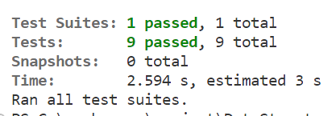

# 목적

타입스크립트로 자료구조를 구현한다.

# 목표

- [x] 링크드리스트
- [x] 스택
- [x] 큐
- [x] 우선순위 큐
- [x] 2d 배열
- [x] 힙
- [ ] 해시맵
- [ ] 트리

# 문제 해결

## jest가 느림

### 상황

제스트(jest)를 적용하여 테스트를 해보니, 튜토리얼 수준에서 조차 10초가 걸렸다.

테스트가 느림

### 해결

[참고](https://stackoverflow.com/questions/68724389/jest-takes-10s-to-run-two-trivial-typescript-tests-how-do-i-determine-why-its)를 바탕으로 `isolatedModules: true`옵션을 활성화 하니 3배 정도 빨라진 결과가 나왔다.

### 분석

`isolatedModules: true`옵션은 제스트와 타입스크립트에 어떤 영향을 끼쳤길래 빨라진걸까? 이 옵션은 타입스크립트 코드를 컴파일할 때, 대상이 되는 모듈만 고려하는 것을 가리킨다. 즉, 프로젝트 전체의 컨텍스트가 아니라 현재 트랜스파일링 되는 파일들을 따로따로 한다는 것이다.

컨텍스트를 고려하지 않으면 어떻게 될까? [참고](https://www.typescriptlang.org/tsconfig#references-to-const-enum-members)에 의하면, enum으로 작성한 코드에서 enum의 키로 반영되는 것이 아니라 밸류가 그대로 쓰이는 것을 볼 수 있다. 즉, 타입스크립트 컴파일러가 제공하는 타입 체킹 기능이 느슨해진 대신에, 퍼포먼스 향상이 일어난 것이다.

### 참고

[ts-jest](https://huafu.github.io/ts-jest/user/config/isolatedModules)

# 참고

- [MSDN: Unit testing best practice](https://learn.microsoft.com/en-us/dotnet/core/testing/unit-testing-best-practices)
